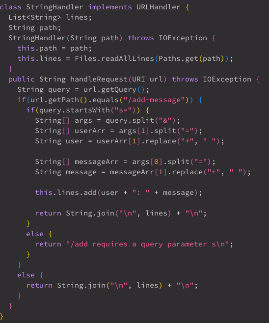
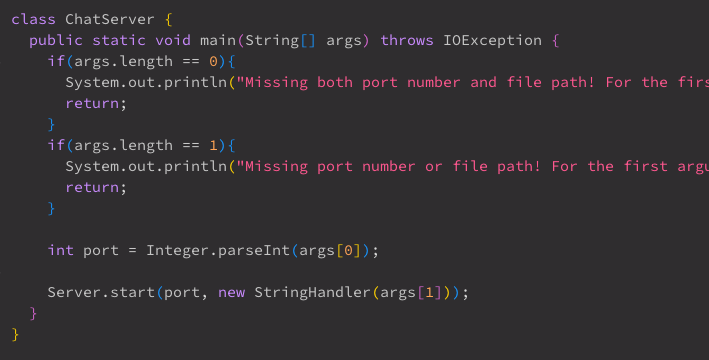
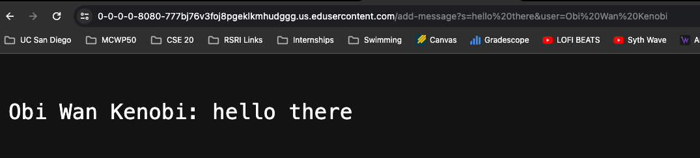
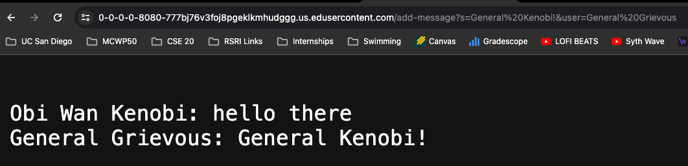
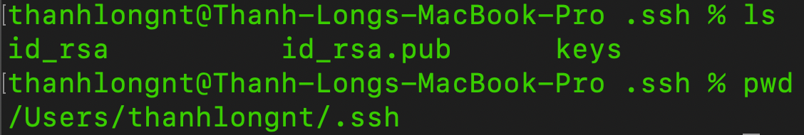
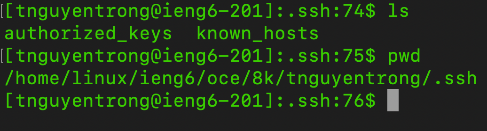
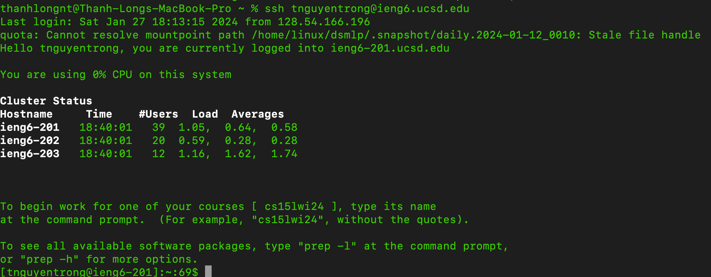

# Lab Report 2
## Part 1
ChatServer Code:

Not shown in screenshots but given Server file from lab 2 is used.

The methods that is called is handleRequests().

The URL is a relevant arguement as all information is being inputed in the queries of the url. The method takes apart the url to find and display the inputted information.

The innitial query gets split (at &) into two arguments to disttinguish which argument is the user and which is the message. Then the two argumetns gets split again to get rid of the variables (s= and user=). 
Finally, the method checks if there are any '+' in the method (because for some reason spaces are replaced with '+') and replaces all '+' will spaces.   

The methods that is called is handleRequests().

The URL is a relevant arguement as all information is being inputed in the queries of the url. The method takes apart the url to find and display the inputted information.

The innitial query gets split (at &) into two arguments to disttinguish which argument is the user and which is the message. Then the two argumetns gets split again to get rid of the variables (s= and user=). 
Finally, the method checks if there are any '+' in the method (because for some reason spaces are replaced with '+') and replaces all '+' will spaces.   

## Part 2
Absolute path to private key for SSH key for logging into `ieng6`

Absolute path to the pyblic key for my SSH key for logging into `ieng6` (on `ieng6` file system)

Terminal interaction logging into `ieng6` without being asked for password.

## Part 3
In the last two weeks, I've learned the basics of url structures and how to read it in code. I've also learned how to ssh into a remote server as well as how to create a private key through the terminal and copy it to the server. Visual Studio Code and JUnit aren't entirely new to me since I've been using them for CSE12 PAs. 
